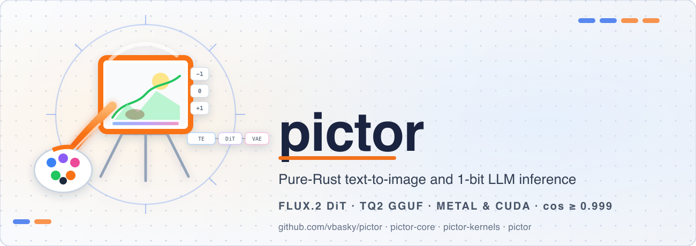

# pictor



**Paint pixels. Write prose. Prove every stage.**

pictor is a Pure Rust inference stack for generative models at the extreme end of
quantization — 1-bit and ternary weights, GGUF on disk, Metal and CUDA on GPU,
and a CPU reference path on every kernel. One codebase runs **text-to-image**
(FLUX.2-Klein) and **LLM inference** (Qwen3 Bonsai) without a Python runtime or
opaque C++ shim in the default build.

**Name:** *Pictor* is Latin for *painter*. The project paints images from prompts
and composes text from tokens — same brush, different canvas.

**North star:** pictor is building toward a **sovereign generative inference
substrate** — one Pure Rust, oracle-validated runtime for every modality that
can be expressed as quantized tensor programs. Image and LLM ship today; audio,
video, multimodal agent sessions, and browser/edge deployment share the same
kernel fabric, GGUF artifact model, and parity contract tomorrow. See
[ROADMAP.md](ROADMAP.md) for the full horizon.

[](LICENSE)
[](https://www.rust-lang.org)
[](crates/pictor-core)
[](https://github.com/vbasky/pictor/stargazers)
[](https://github.com/vbasky)

**Lineage:** pictor continues [oxibonsai](https://github.com/cool-japan/oxibonsai)
(COOLJAPAN OU, Apache-2.0). See [NOTICE](NOTICE) and
[docs/CONTRIBUTING.md](docs/CONTRIBUTING.md) before redistributing or contributing.

---

## Why pictor exists

Most generative stacks split the problem in two: a Python reference you trust,
and a production path you hope matches it. pictor inverts that contract.

**Parity is the product.** Image stages gate at cosine ≥ 0.999 against MLX
goldens. LLM kernels cross-check reference, AVX2, AVX-512, NEON, and GPU tiers.
A faster kernel that fails the oracle is a regression — not a release note.

**Extreme quantization is first-class.** Q1_0_g128 (1-bit) and TQ2_0_g128
(ternary `{-1, 0, +1}`) are not experiments bolted onto an FP16 engine. The
dequant, GEMV, GEMM, fused full-forward, and flash-attention paths were built for
sub-byte weights from the ground up.

**One engine, many modalities.** GGUF I/O, kernel dispatch, and GPU graph execution
are shared infrastructure. Diffusion and autoregression are the first two
pipelines on the same metal — not the last. The goal is a single auditable
artifact from laptop to datacenter, without a Python reference runtime and a
production runtime you hope match.

| | Typical generative stack | pictor |
| --- | --- | --- |
| **Runtime** | Python + PyTorch / MLX + C++ helpers | Pure Rust workspace |
| **Weight formats** | FP16/BF16 checkpoints | Q1 / TQ2 / K-quant / FP8 in GGUF |
| **Correctness story** | "Looks fine" / eyeball | Oracle parity harnesses per stage |
| **GPU** | Framework-managed | Native Metal + NVRTC CUDA Graphs |
| **CPU fallback** | Often missing or slow | Always available (Rayon + SIMD) |
| **Serving** | Separate server project | OpenAI-compatible runtime built in |
| **Default FFI** | CUDA/cuBLAS, Python extensions | Zero in default build |

---

## Two pipelines, one stack

### Text-to-image — FLUX.2-Klein @ 512²

A complete Bonsai-Image port: prompt in, PNG out, every intermediate tensor
measured against reference taps.

```text
  prompt
    │
    ▼
┌─────────────┐    ┌──────────────────┐    ┌─────────────┐    ┌─────┐
│ Qwen3 TE    │───▶│ FLUX.2 DiT       │───▶│ VAE decode  │───▶│ PNG │
│ 4-bit MLX   │    │ TQ2_0_g128 GGUF  │    │ safetensors │    └─────┘
└─────────────┘    └──────────────────┘    └─────────────┘
     te_parity           dit_parity (59)         vae_parity (11)
                    cos ≥ 0.999 each stage
```

| Platform | Backend | 512×512, 4 steps |
| --- | --- | --- |
| Apple Silicon (M3-class) | Metal | ≈ 52–62 s |
| NVIDIA A4000-class | CUDA | ≈ 31.7 s |
| Any | CPU (Rayon + NEON) | ≈ 10–15 min |

GPU wins are independently validated: v10 ternary GEMM (~3.8× over v9), joint
flash-attention (~5.5× over CPU), implicit-GEMM VAE conv (~3.2× over CPU). Details:
[`crates/pictor-image/README.md`](crates/pictor-image/README.md).

### LLM inference — Qwen3 Bonsai in GGUF

Autoregressive generation with production-grade sampling, constraints, and serving.

```text
  prompt
    │
    ▼
┌────────────┐    ┌─────────────────────┐    ┌──────────┐    ┌────────┐
│ Tokenizer  │───▶│ Qwen3 transformer   │───▶│ Sampler  │───▶│ tokens │
│ BPE/WP/UG  │    │ Q1 / TQ2 weights    │    │ + grammar│    └────────┘
└────────────┘    └─────────────────────┘    └──────────┘
                  KV cache · speculative decode
                  Metal/CUDA fused full-forward
```

Grammar constraints (BNF, GBNF, JSON Schema, regex), tool-calling API,
speculative decoding, beam search, continuous batching, prefix cache, RAG hooks,
and `/v1/chat/completions` — all in-tree. Details:
[`crates/pictor-runtime/README.md`](crates/pictor-runtime/README.md).

---

## The parity contract

pictor does not ship "close enough" numerics for core inference paths.

**Image oracle gates**

| Harness | What it checks |
| --- | --- |
| `te_parity` | Text-encoder hidden states vs MLX |
| `dit_parity` | 59 DiT forward taps, each cos ≥ 0.999 |
| `vae_parity` | 11 VAE decode taps |
| `vae_safetensors_parity` | Native loader vs reference weights, bit-identical |

**LLM kernel gates** — scalar reference is law; SIMD and GPU tiers must match
within tolerance on randomized fixtures before they ship.

**RNG** — Threefry seeding reproduces MLX latents byte-for-byte in the image path.

That discipline is why FP32 accumulate is kept through the image pipeline: no TF32
or FP16-MAC shortcuts that trade parity for benchmark charts.

---

## Workspace

Ten crates, one policy: Pure Rust, test-heavy, oracle-gated.

| Crate | Role | Tests |
| --- | --- | --- |
| [`pictor-core`](crates/pictor-core) | GGUF parser, quant blocks, model config | 207+ |
| [`pictor-kernels`](crates/pictor-kernels) | 1-bit / ternary / FP8 GEMV·GEMM, SIMD + GPU | 675+ |
| [`pictor-model`](crates/pictor-model) | Qwen3 transformer, KV cache, attention | 673+ |
| [`pictor-runtime`](crates/pictor-runtime) | Inference engine, sampling, server hooks | 796+ |
| [`pictor-tokenizer`](crates/pictor-tokenizer) | BPE / Unigram / WordPiece, HF `tokenizer.json` | 268+ |
| [`pictor-rag`](crates/pictor-rag) | Chunking, embedder, vector store, pipeline | 871+ |
| [`pictor-eval`](crates/pictor-eval) | Perplexity, BLEU, ROUGE harness | — |
| [`pictor-serve`](crates/pictor-serve) | Standalone OpenAI-compatible server binary | 260+ |
| [`pictor-image`](crates/pictor-image) | FLUX.2 text-to-image pipeline | parity harness |
| [`pictor`](crates/pictor) | Facade — re-exports the LLM stack | — |

```text
                    ┌──────────── pictor (facade) ────────────┐
                    │                                         │
   pictor-image ────┤  core ◄──► kernels ◄──► model           │
        │           │              │              │           │
        │           │         runtime ◄──► tokenizer        │
        │           │              │                        │
        └───────────┤         serve · rag · eval              │
                    └─────────────────────────────────────────┘
                              CPU · Metal · CUDA
```

---

## Quick start

### Prerequisites

- **Rust 1.86+** — [rustup](https://rustup.rs/)
- **Model assets** — HuggingFace downloads for Bonsai-Image / Bonsai LLM GGUF
  (see crate READMEs)
- **GPU feature** — `metal` on macOS, `native-cuda` on Linux/Windows

### Build

```bash
git clone https://github.com/vbasky/pictor.git
cd pictor

# Apple Silicon
cargo build --release --features metal

# NVIDIA
cargo build --release --features native-cuda

# CPU only (always works)
cargo build --release
```

### Generate an image

```toml
# Cargo.toml
[dependencies]
pictor-image = { path = "crates/pictor-image", features = ["metal"] }
```

```rust,no_run
use std::path::PathBuf;
use pictor_image::pipeline::{text_to_image, TeSource, TextToImageCfg};

let cfg = TextToImageCfg {
    prompt: "a tiny bonsai tree in a ceramic pot".into(),
    seed: 42,
    steps: 4,
    width: 512,
    height: 512,
    guidance: 1.0,
    dit_gguf: PathBuf::from("./bonsai-dit.gguf"),
    vae_weights_dir: PathBuf::from("./bonsai-vae/vae/diffusion_pytorch_model.safetensors"),
    te_source: TeSource::Mlx4bit(PathBuf::from("./bonsai-te/text_encoder-mlx-4bit/model.safetensors")),
    tokenizer_dir: PathBuf::from("./bonsai-te/text_encoder-mlx-4bit"),
    golden_override: None,
};

let out = text_to_image(&cfg)?;
std::fs::write("bonsai.png", &out.png)?;
```

Asset paths can also be set via `PICTOR_DIT_GGUF`, `PICTOR_TE_4BIT`, `PICTOR_VAE_WEIGHTS`,
and related env vars — see [`crates/pictor-image/README.md`](crates/pictor-image/README.md).

### Run an LLM

```toml
[dependencies]
pictor-runtime = { path = "crates/pictor-runtime", features = ["metal"] }
```

```rust,no_run
use pictor_runtime::{EngineBuilder, SamplingPreset};

let engine = EngineBuilder::new()
    .model_path("models/Bonsai-8B.gguf")
    .preset(SamplingPreset::Balanced)
    .max_seq_len(4096)
    .build()?;
```

Or pull the full stack through the facade:

```toml
[dependencies]
pictor = { path = "crates/pictor", features = ["full", "metal"] }
```

---

## GPU backends

| Feature | Backend | Platform | Notes |
| --- | --- | --- | --- |
| `metal` | Apple Silicon | macOS | Fused TQ2 forward, flash-attn, VAE — default-on |
| `native-cuda` | NVIDIA NVRTC + CUDA Graphs | Linux / Windows | DiT, VAE, LLM prefill paths |
| *(none)* | CPU | everywhere | AVX2 / AVX-512 / NEON auto-detect via `KernelDispatcher` |

Metal and CUDA are mutually exclusive at build time (`target_os`). The CPU path
is always compiled in.

Toggle runtime GPU stages with `PICTOR_DIT_GPU`, `PICTOR_DIT_ATTN_GPU`, `PICTOR_VAE_GPU`,
and `PICTOR_TE_GPU` — documented in the image crate README.

---

## Status

`0.1.x` — dual pipelines shipping, parity gates enforced, 4 000+ tests across the
workspace. Image path is stable at 512²; LLM runtime is feature-complete (grammar,
tool calling, speculative decode, OpenAI server). CUDA batched-prefill correctness
fixes are the top open P0 — see [ROADMAP.md](ROADMAP.md).

---

## Contributing

pictor is derived from oxibonsai (COOLJAPAN OU). **Do not relicense inherited code
to BSD or MIT** without upstream permission. Read
[docs/CONTRIBUTING.md](docs/CONTRIBUTING.md) before opening a PR.

High-leverage open work: CUDA Q1/TQ2 prefill parity, VAE tiling for >512px, unified CLI.

---

## License

Apache-2.0 — derived from [oxibonsai](https://github.com/cool-japan/oxibonsai)
(COOLJAPAN OU). See [LICENSE](LICENSE) and [NOTICE](NOTICE). Modifications © 2026
Vikram Bhaskaran.

Sibling projects [viser](https://github.com/vbasky/viser) and
[revelo](https://github.com/vbasky/revelo) are independent originals under
BSD-2-Clause — different lineage, different license.